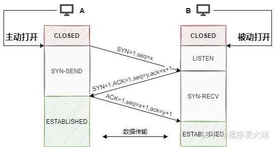

# 网络分层结构
* 应用层：为应用程序提供交互服务，比如DNS、HTTP、SMTP等
  + 表示层：数据的表示、安全、压缩等
  + 会话层：会话的建立、管理、终止等
* 传输层：负责为进程间的通信提供服务，传输控制协议TCP、用户数据协议UDP
* 网络层：选择合适的路由和交换节点，确保数据的及时传送，主要为IP协议
* 数据链路层：将IP数据报组装成数据帧，在两个相邻节点的链路上传送数据帧
* 物理层：实现相邻节点比特流的透明传输，屏蔽传输介质和物理设备的差异
# 三次握手

1. 第一次握手：客户端生成一个随机起始序列号x，添加标志位SYN=1，序列号seq=x，客户端状态又closed切换为syn-send
2. 第二次握手：服务端收到客户端报文后，生成随机起始序列号y，添加标志位SYN=1，ACK=1，序列号seq=y，确认号ack=x+1，服务端状态由listen切换为syn-recy
3. 第三次握手：客户端收到服务端报文后，添加标志位ACK=1，序列号seq=x+1，确认号ack=y+1
