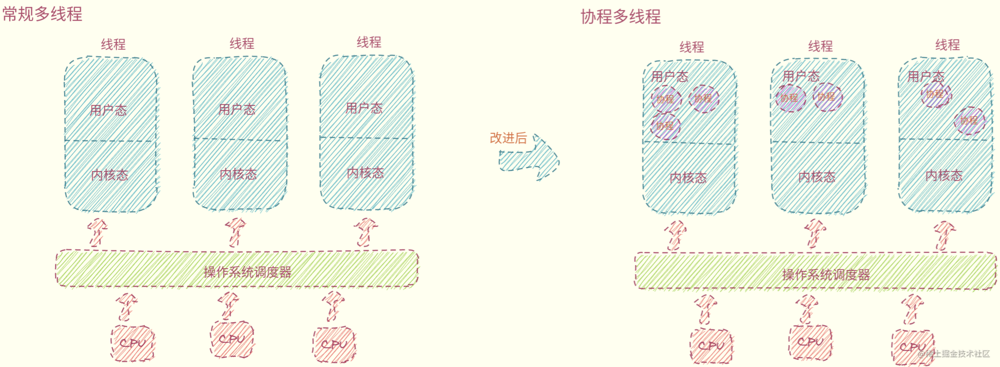
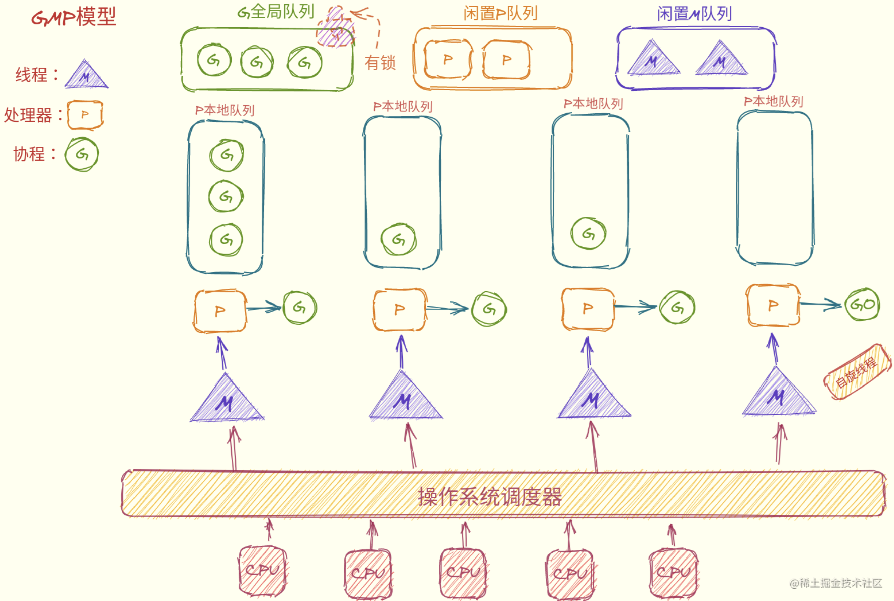
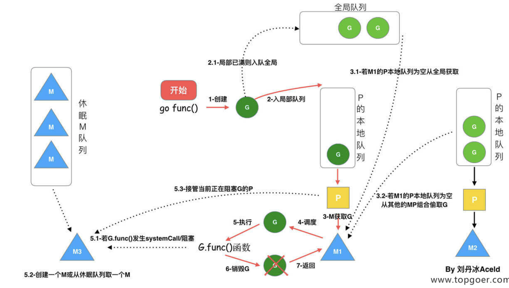

# 并发编程

## 协程

线程：由CPU调度，是抢占式的
协程：由用户态调度，是协作式的
共同点：独立的栈空间，共享堆空间



## GMP


* 初始化
  + M0：主线程，负责初始化操作和启动G0
  + G0：创建的第一个协程，负责调度G
* 调度策略
  + 复用线程：避免频繁创建和销毁线程
  + work stealing：local——》global——》other
  + hand off：当线程阻塞时，P释放绑定的M，从闲置M队列中绑定其他M

## GMP实例



## Goroutine

```go
go func() {
    fmt.Pringln("First Goroutine~~")
}()
```

## Channel

设计原则：通过共享内存实现通信，而不是使用加锁实现通信
通道：遵循FIFO，保证收发数据的顺序，协程安全

```go
// 通道是引用类型，默认为nil
var ch1 chan int
// 无缓冲区的通道
ch2 := make(chan int)
// 有缓冲区的通道
ch2 := make(chan int, 10)
// 把10发送到ch中
ch <- 10 
// 从ch中接收值并赋值给变量x
x, ok := <- ch 
// 关闭通道
close(ch)
```

* 对一个关闭的通道再发送值就会导致panic
* 关闭一个已经关闭的通道会导致panic
* 对一个关闭的通道进行接收会一直获取值直到通道为空
* 对一个关闭的并且没有值的通道执行接收操作会得到对应类型的零值

## 定时器

* Timer

```go
// 创建定时器
func NewTimer(d Duration) *Timer
// 定时器使用
<-timer.C
func Sleep(d Duration)
func After(d Duration) <-chan Time
func AfterFunc(d Duration, f func()) *Timer
// 停止定时器
func (t *Timer) Stop() bool
// 重新设置定时器时间
func (t *Timer) Reset(d Duration) bool
```

* Ticker

```go
ticker := time.NewTicker(time.Second)

go func() {
	i := 0
	for true {
		i++
		if i == 5 {
			ticker.Stop()
            break
		}
		fmt.Println(i)
		<-ticker.C
	}
}()
```

## 多路复用

```go
select {
    case s1 := <-chan1:
    // 如果chan1成功读到数据，则进行该case处理语句
    case chan2 <- s2:
    // 如果成功向chan2写入数据，则进行该case处理语句
    default:
    // 如果上面都没有成功，则进入default处理流程
}
```

* select可以同时监听一个或多个channel，直到其中一个channel ready
* 如果多个channel同时ready，则随机选择一个执行

## 并发工具

* lock

```go
// 互斥锁
var lock sync.Mutex
// 读写锁
var rwlock sync.RWMutex
```

* sync
  + sync. WaitGroup：并发执行N个任务
    - `Add(delta int)`：计数器+delta
    - `Done()`：计数器-1
    - `Wait()`：阻塞直到计数器变为0
  + sync. Once：高并发的场景下只执行一次
    - `func (o *Once) Do(f func()) {}`
  + sync. Map：并发安全的map集合
    - Store、Load、LoadOrStore、Delete、Range等
* atomic：提供原子操作的方法
   
