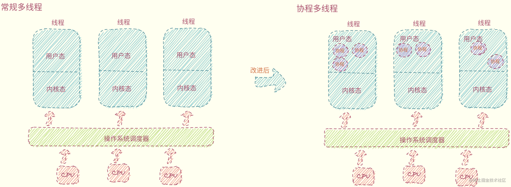
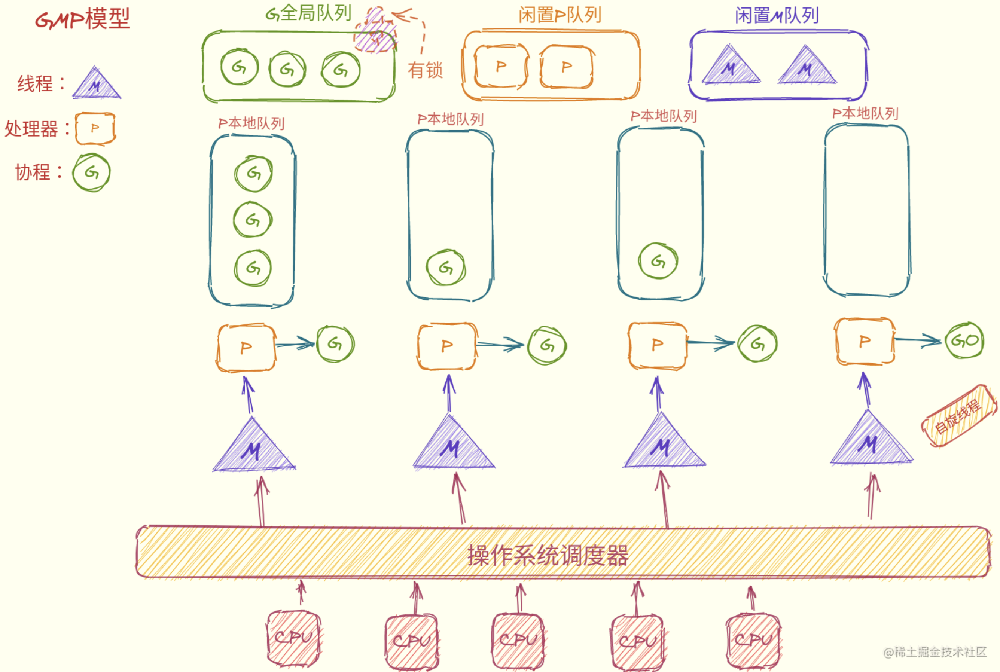
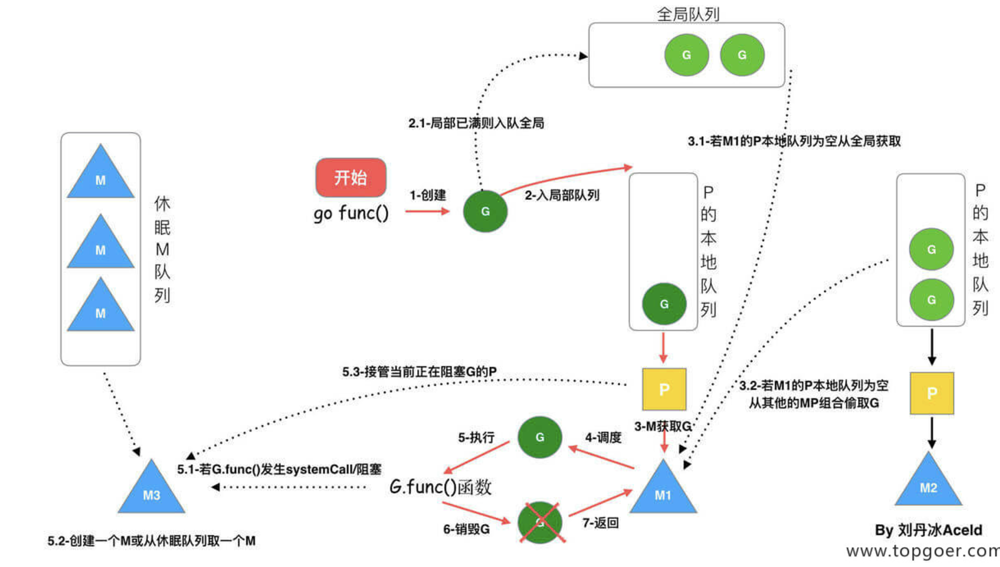
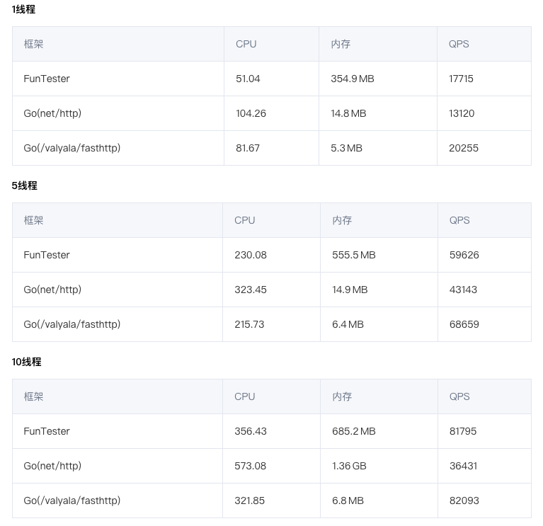

# 开发环境
* 解压文件

```shell
tar -zxvf ***.tar.gz
```

* 配置环境变量

```shell
# 基本配置
export GOROOT=/Users/hang/aHang/environment/go
export PATH=$GOROOT/bin:$PATH
export GOPATH=/Users/hang/aHang/go

# 包管理
export GO111MODULE=on
export GOPROXY=https://goproxy.cn
export GOPRIVATE="git.mycompany.com"

# Goland
GOPROXY=https://goproxy.cn;GOSUMDB=off;GO111MODULE=on
```

* 项目管理

```shell
bin：编译后的可执行文件
pkg：编译后的库文件
src：源代码文件
```

* 常用命令

```shell
go env：用于打印Go语言的环境信息。

go run：命令可以编译并运行命令源码文件。

go get：可以根据要求和实际情况从互联网上下载或更新指定的代码包及其依赖包，并对它们进行编译和安装。

go mod init：初始化module项目
go mod tidy：清理依赖

go build：命令用于编译我们指定的源码文件或代码包以及它们的依赖包。

go install：用于编译并安装指定的代码包及它们的依赖包。

go clean命令会删除掉执行其它命令时产生的一些文件和目录。

go test：命令用于对Go语言编写的程序进行测试。

go list：命令的作用是列出指定的代码包的信息。

go fix：会把指定代码包的所有Go语言源码文件中的旧版本代码修正为新版本的代码。
```

# 基本语法

```go
// 定义包
package main

// 导入其他包
import "fmt"

// 定义结构体
type Student struct {
	Name  string 
	class string  
}

// 为Student添加方法  
func (s Student) SayHello() {
	fmt.Println("Hello, Student")
}

// 入口函数
func main() {
   var s Student
	s.SayHello()
}
```

## 数据类型

* 值类型
  + 有符号整数：int, int8, int16, int32, int64
  + 无符号整数：uint, uint8, uint16, uint32, uint64
  + 特殊字符：byte(ASCII)、rune(UTF-8)
  + 布尔：bool
  + 浮点数：float32, float64
  + 字符串：string
  + 虚数：complex64, complex128
  + 结构体：struct
  + 数组：array
  + 常量：const
  + 匿名：_
* 引用类型
  + 切片：slice
  + 键值对：map
  + 通道：chan
* 类型转换
  + 只有强制类型转换：`T(表达式)`

## 指针

注意：Go中的指针不能进行移位和运算
* make & new：用于内存分配
  + new：func new(Type) *Type
  + func make(t Type, size ... IntegerType) Type
* make：只用于slice、map、chan，返回引用类型本身
* new：适用于所有类型，返回类型指针

## 流程控制

* if：条件判断
* for：循环（range：array、slice、chan、map）
* switch：选择
* goto、break、continue、fallthrough

## 函数

* 函数定义

```go
func 函数名(普通参数, ...可变参数)(返回值){
    函数体
}
```

* 可变参数

```go
func intSum2(x ...int) int {
	fmt.Println(x) //x是一个切片
	sum := 0
	for _, v := range x {
		sum = sum + v
	}
	return sum
}
```

* 函数类型

```go
// 函数类型
type calculation func(int, int) int
// add函数
func add(x, y int) int {
	return x + y
}
// sub函数
func sub(x, y int) int {
	return x - y
}
// 函数变量
var c calculation
c = add
```

* 匿名函数

```go
func(参数)(返回值){
    函数体
}
```

* 闭包 = 函数 + 引用环境

```go
func calc(base int) (func(int) int, func(int) int) {
	add := func(i int) int {
		base += i
		return base
	}

	sub := func(i int) int {
		base -= i
		return base
	}
	return add, sub
}
```

* 延迟语句：延迟逆序执行，注册时确定所有变量的值

```go
func calc(index string, a, b int) int {
	ret := a + b
	fmt.Println(index, a, b, ret)
	return ret
}

func main() {
	x := 1
	y := 2
	defer calc("AA", x, calc("A", x, y))
	x = 10
	defer calc("BB", x, calc("B", x, y))
	y = 20
}

/* 执行结果：
		A 1 2 3
		B 10 2 12
		BB 10 12 22
		AA 1 3 4	
*/
```

* 内置函数

```go
append：用来追加元素到数组、slice中, 返回修改后的数组、slice
close：主要用来关闭channel
delete：从map中删除key对应的value
panic：停止常规的goroutine  （panic和recover：用来做错误处理）
recover：允许程序定义goroutine的panic动作
real：返回complex的实部   （complex、real imag：用于创建和操作复数）
imag：返回complex的虚部
make：用来分配内存，返回Type本身(只能应用于slice, map, channel)
new：用来分配内存，主要用来分配值类型，比如int、struct。返回指向Type的指针
cap：capacity是容量的意思，用于返回某个类型的最大容量（只能用于切片和 map）
copy：用于复制和连接slice，返回复制的数目
len：来求长度，比如string、array、slice、map、channel ，返回长度
print、println：底层打印函数，在部署环境中建议使用 fmt 包
```

## 包管理

* package

```go
package main
```

* 可见性

```go
type Student struct {
	Name  string // 可在包外访问的方法
	class string // 仅限包内访问的字段
}
```

* init初始化函数

```go
func init() {
  // 初始化代码
}
```

## 数组

```go
// 声明方式一
var array [3]int
// 声明方式二
array := [...]string{"北京", "上海", "深圳"}
// 多维数组
array := [3][2]string{
	{"北京", "上海"},
	{"广州", "深圳"},
	{"成都", "重庆"},
}

// 方法1：for循环遍历
for i := 0; i < len(a); i++ {
	fmt.Println(a[i])
}

// 方法2：for range遍历
for index, value := range a {
	fmt.Println(index, value)
}
```

## 常用包

* math：数学
* time：时间
* strings：字符串
* strconv：字符串转换
* rand：随机数
* reflect：反射包
* sync：并发包
* fmt：数据格式化包
* json：序列化包
* sort：排序

## 接口

非侵入式接口：对象实现了接口的全部方法，则对象是一个接口的实现类

```go
type Sayer interface {
	say()
}

type dog struct {
	age int
}

// 值传递：拷贝
func (d *dog) say() {
	rand.Seed(time.Now().UnixNano())
	fmt.Println(d.age)
	d.age = rand.Intn(100)
	fmt.Println(d.age)
}

// 值传递：地址
func (d dog) say() {
	rand.Seed(time.Now().UnixNano())
	fmt.Println(d.age)
	d.age = rand.Intn(100)
	fmt.Println(d.age)
}
```

## 空接口

空接口：可以接受任意类型的数据， `interface{}`

* 空接口 = 动态类型 + 动态值
* 接口断言：`x.(T)`

## 异常处理

* 方式一

```go
func f() {
	defer func() { 
        // 捕获异常panic
		if err := recover(); err != nil {
			fmt.Println(err) // 处理异常
		}
	}()
	panic("异常信息") // 跑出异常
}
```

* 方式二

```go
f, err := os.Open("file.txt")
if err != nil {
    // handle error here
}
```

# struct
* 自定义类型

```go
// 自定义类型：MyInt是一种新的类型，它具有int的特性
type MyInt int

// 类型别名：只是起了一个新的名字
type MyInt = int
```

* 结构体

```go
type Student struct {
	Name  string // 可在包外访问的方法
	class string // 仅限包内访问的字段
}
```

* 方法

```go
//MyInt 将int定义为自定义MyInt类型
type MyInt int

//SayHello 为MyInt添加一个SayHello的方法
func (m MyInt) SayHello() {
	fmt.Println("Hello, 我是一个int。")
}
func main() {
	var m1 MyInt
	m1.SayHello() //Hello, 我是一个int。
	m1 = 100
	fmt.Printf("%#v  %T\n", m1, m1) //100  main.MyInt
}
```

* tag

```go
type Student struct {
	ID     int    `json:"id"` // 通过指定tag实现json序列化该字段时的key
	Gender string // json序列化是默认使用字段名作为key
	name   string // 私有不能被json包访问
}
```

# slice

切片：变长数组，底层数组指针 + 切片长度 + 切片容量
* 扩容策略
  + < 1024：翻倍扩容
  + \>= 1024：1/4倍扩容
  + 最终容量溢出：最终容量

```go
// 声明slice
var name []T
name := []T{}
make([]T, size, cap)

// 遍历
for i := 0; i < len(s); i++ {
	fmt.Println(i, s[i])
}
for index, value := range s {
	fmt.Println(index, value)
}

// 添加元素
s = append(s, 1, 2, 3)

// 删除元素
a = append(a[:2], a[3:]...)
```

# map

map：是一种无序的基于key-value的数据结构
* key-value分开存放
* 扩容策略：翻倍扩容
* 渐进式扩容：每次进行读写时完成部分数据迁移
* 等量扩容：创建数量和旧桶一样多的桶

```go
// 第一种
var m map[KeyType]ValueType
// 第二种
m := make(map[KeyType]ValueType, [cap])

// 判断某个key是否存在
value, ok := m[key]

// 删除某个键值对
delete(m, key)

// 遍历
for k, v := range scoreMap {
	fmt.Println(k, v)
}
```

# 反射

变量 = 值信息 + 类型信息

```go
// 获取对象类型
typeOf := reflect.TypeOf(val)

// 创建对象
value := reflect.New(typeOf)

// 设置属性值
value.Elem().FieldByName("Name").SetString("hang")
value.Elem().FieldByName("Age").SetInt(25)
fmt.Println(value)

// 执行方法
value.MethodByName("Hello").Call([]reflect.Value{})
```

# 网络编程

## TCP

* server

```go
func Server() {
	lis, err := net.Listen("tcp", "127.0.0.1:9090")
	if err != nil {
		log.Panic(err)
	}

	go func() {
		for {
			conn, err := lis.Accept()
			if err != nil {
				fmt.Println("accept failed, err:", err)
				continue
			}
			go process(conn)
		}
	}()
}

func process(conn net.Conn) {
	defer conn.Close()
	for {
		var buf [128]byte
		n, err := conn.Read(buf[:])
		if err != nil {
			fmt.Println("read from client failed, err:", err)
			break
		}
		recvStr := string(buf[:n])
		fmt.Println("client to server: ", recvStr)
		conn.Write([]byte("server to client: " + recvStr))
	}
}
```

* client

```go
func Client() {
	conn, err := net.Dial("tcp", "127.0.0.1:9090")
	if err != nil {
		fmt.Println("err :", err)
		return
	}
	defer conn.Close()
	read := bufio.NewReader(os.Stdin)
	for {
		input, _ := read.ReadString('\n')
		inputInfo := strings.Trim(input, "\r\n")
		if strings.ToUpper(inputInfo) == "Q" {
			return
		}
		_, err = conn.Write([]byte(inputInfo))
		if err != nil {
			return
		}
		buf := [512]byte{}
		n, err := conn.Read(buf[:])
		if err != nil {
			fmt.Println("recv failed, err: ", err)
			return
		}
		fmt.Println(string(buf[:n]))
	}
}
```

## UDP

* server

```go
func Server() {
	listenUDP, err := net.ListenUDP("udp", &net.UDPAddr{
		IP:   net.IPv4(127, 0, 0, 1),
		Port: 9090,
	})
	if err != nil {
		fmt.Println("listen failed, err:", err)
		return
	}
	defer listenUDP.Close()

	for {
		var data [1024]byte
		n, addr, err := listenUDP.ReadFromUDP(data[:]) // 接收数据
		if err != nil {
			fmt.Println("read udp failed, err:", err)
			continue
		}
		fmt.Printf("data:%v addr:%v count:%v\n", string(data[:n]), addr, n)
		_, err = listenUDP.WriteToUDP(data[:n], addr) // 发送数据
		if err != nil {
			fmt.Println("write to udp failed, err:", err)
			continue
		}
	}
}
```

* client

```go
func Client() {
	udpConn, err := net.DialUDP("udp", nil, &net.UDPAddr{
		IP:   net.IPv4(127, 0, 0, 1),
		Port: 9090,
	})
	if err != nil {
		fmt.Println("连接服务端失败，err:", err)
		return
	}
	defer udpConn.Close()
	sendData := []byte("Hello server")
	_, err = udpConn.Write(sendData) // 发送数据
	if err != nil {
		fmt.Println("发送数据失败，err:", err)
		return
	}
	data := make([]byte, 4096)
	n, remoteAddr, err := udpConn.ReadFromUDP(data) // 接收数据
	if err != nil {
		fmt.Println("接收数据失败，err:", err)
		return
	}
	fmt.Printf("recv:%v addr:%v count:%v\n", string(data[:n]), remoteAddr, n)
}
```

## HTTP

* server

```go
func Server() {
	http.HandleFunc("/hello01", func(w http.ResponseWriter, r *http.Request) {
		fmt.Println(r.RemoteAddr, "连接成功")
		// 请求方式：GET POST DELETE PUT UPDATE
		fmt.Println("method:", r.Method)
		fmt.Println("url:", r.URL.Path)
		fmt.Println("header:", r.Header)
		fmt.Println("body:", r.Body)
		// 回复
		w.Write([]byte("hang"))
	})

	http.Handle("/hello02", &MyHandler{})

	http.ListenAndServe(":8080", nil)
}

type MyHandler struct {
}

func (*MyHandler) ServeHTTP(w http.ResponseWriter, r *http.Request) {
	fmt.Println("123")
}
```

* client

```go
func Client() {
	resp, _ := http.Get("https://www.baidu.com")
	defer resp.Body.Close()

	readAll, _ := ioutil.ReadAll(resp.Body)

	fmt.Println(string(readAll))
}
```

# 并发编程

## 协程

线程：由CPU调度，是抢占式的
协程：由用户态调度，是协作式的
共同点：独立的栈空间，共享堆空间



## GMP


* 初始化
  + M0：主线程，负责初始化操作和启动G0
  + G0：创建的第一个协程，负责调度G
* 调度策略
  + 复用线程：避免频繁创建和销毁线程
  + work stealing：local——》global——》other
  + hand off：当线程阻塞时，P释放绑定的M，从闲置M队列中绑定其他M

## GMP实例



## Goroutine

```go
go func() {
    fmt.Pringln("First Goroutine~~")
}()
```

## Channel

设计原则：通过共享内存实现通信，而不是使用加锁实现通信
通道：遵循FIFO，保证收发数据的顺序，协程安全

```go
// 通道是引用类型，默认为nil
var ch1 chan int
// 无缓冲区的通道
ch2 := make(chan int)
// 有缓冲区的通道
ch2 := make(chan int, 10)
// 把10发送到ch中
ch <- 10 
// 从ch中接收值并赋值给变量x
x, ok := <- ch 
// 关闭通道
close(ch)
```

* 对一个关闭的通道再发送值就会导致panic
* 关闭一个已经关闭的通道会导致panic
* 对一个关闭的通道进行接收会一直获取值直到通道为空
* 对一个关闭的并且没有值的通道执行接收操作会得到对应类型的零值

## 定时器

* Timer

```go
// 创建定时器
func NewTimer(d Duration) *Timer
// 定时器使用
<-timer.C
func Sleep(d Duration)
func After(d Duration) <-chan Time
func AfterFunc(d Duration, f func()) *Timer
// 停止定时器
func (t *Timer) Stop() bool
// 重新设置定时器时间
func (t *Timer) Reset(d Duration) bool
```

* Ticker

```go
ticker := time.NewTicker(time.Second)

go func() {
	i := 0
	for true {
		i++
		if i == 5 {
			ticker.Stop()
            break
		}
		fmt.Println(i)
		<-ticker.C
	}
}()
```

## 多路复用

```go
select {
    case s1 := <-chan1:
    // 如果chan1成功读到数据，则进行该case处理语句
    case chan2 <- s2:
    // 如果成功向chan2写入数据，则进行该case处理语句
    default:
    // 如果上面都没有成功，则进入default处理流程
}
```

* select可以同时监听一个或多个channel，直到其中一个channel ready
* 如果多个channel同时ready，则随机选择一个执行

## 并发工具

* lock

```go
// 互斥锁
var lock sync.Mutex
// 读写锁
var rwlock sync.RWMutex
```

* sync
  + sync. WaitGroup：并发执行N个任务
    - `Add(delta int)`：计数器+delta
    - `Done()`：计数器-1
    - `Wait()`：阻塞直到计数器变为0
  + sync. Once：高并发的场景下只执行一次
    - `func (o *Once) Do(f func()) {}`
  + sync. Map：并发安全的map集合
    - Store、Load、LoadOrStore、Delete、Range等
* atomic：提供原子操作的方法
   

# compare

Go的特点
* 快速的编译时间，开发效率和运行效率高
* 代码灵活、组合的思想、无侵入式的接口
* 部署方便，二进制文件，直接部署
  + 源代码——》编译——》机器码
* 天生支持并发，协程

Java的特点
* 优秀的文档、三方库
* 灵活性高、完善的语言特性
* 依靠JVM实现的跨平台性
  + 源代码——》编译——》字节码——》JVM——》翻译——》机器码

HTTP性能对比
* FunTester：Java中HTTPClient测试
* net/http：Go单协程 + HTTP包
* /valyala/fasthttp：Go多协程 + HTTP包


