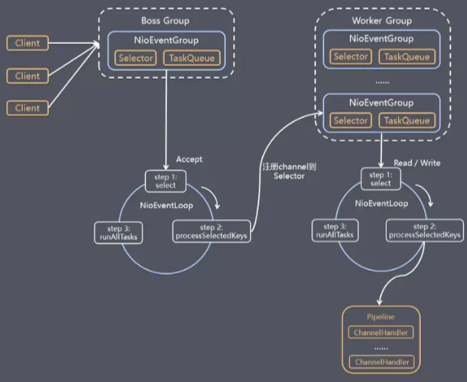

# Java 网络编程

## UDP Socket

* Server

```java
public class Server {
    public static void main(String[] args) throws IOException {
        // 本地监听端口
        DatagramSocket datagramSocket = new DatagramSocket(8000);
        // 接受数据包的字节数组
        byte[] bytes = new byte[1024];
        // 新建数据包：字节数组 + 数组长度
        DatagramPacket datagramPacket = new DatagramPacket(bytes, bytes.length);
        // 等待连接
        while (true) {
            // 等待接受数据包
            datagramSocket.receive(datagramPacket);
            // 编码接受的数据
            String receive = new String(bytes, 0, datagramPacket.getLength());
            System.out.println(receive);
            // 发送数据包
            byte[] send = "Good by~~".getBytes(StandardCharsets.UTF_8);
            // 发送端口
            datagramSocket.send(new DatagramPacket(send, 0, send.length, InetAddress.getLocalHost(), 8001));
            // 断开连接
            datagramSocket.disconnect();
        }
    }
}
```

* Client

```java
public class Client {
    public static void main(String[] args) throws IOException {
        // 本地监听端口
        DatagramSocket datagramSocket = new DatagramSocket(8001);
        // 发送数据包
        byte[] send = "Good by~~".getBytes(StandardCharsets.UTF_8);
        datagramSocket.send(new DatagramPacket(send, 0, send.length, InetAddress.getLocalHost(), 8000));
        // 等待接受数据包
        byte[] bytes = new byte[1024];
        DatagramPacket datagramPacket = new DatagramPacket(bytes, 0, bytes.length);
        datagramSocket.receive(datagramPacket);
        // 编码接受的数据
        String receive = new String(bytes, 0, datagramPacket.getLength());
        System.out.println(receive);
        // 断开连接
        datagramSocket.disconnect();
    }
}
```

## BIO Socket

* Server

```java
public class Server {
    public static void main(String[] args) throws IOException {
        // 创建ServerSocket
        ServerSocket serverSocket = new ServerSocket(8888);
        // 等待连接
        Socket accept = null;
        while ((accept = serverSocket.accept()) != null) {
            // 获取输入输出流
            BufferedReader bufferedReader = new BufferedReader(new InputStreamReader(accept.getInputStream()));
            BufferedWriter bufferedWriter = new BufferedWriter(new OutputStreamWriter(accept.getOutputStream()));
            // 读取数据
            String readLine = bufferedReader.readLine();
            System.out.println(readLine);
            // 写入数据
            bufferedWriter.write("hello hp~~\n");
            bufferedWriter.flush();
            // 关闭连接
            bufferedReader.close();
            bufferedWriter.close();
            accept.close();
        }
    }
}
```

* Client

```java
public class Client {
    public static void main(String[] args) throws IOException {
        // 创建Socket
        Socket socket = new Socket("localhost", 8888);
        // 获取输入输出流
        BufferedReader bufferedReader = new BufferedReader(new InputStreamReader(socket.getInputStream()));
        BufferedWriter bufferedWriter = new BufferedWriter(new OutputStreamWriter(socket.getOutputStream()));
        // 写入数据
        bufferedWriter.write("hello hp~~\n");
        bufferedWriter.flush();
        // 读取数据
        String readLine = bufferedReader.readLine();
        System.out.println(readLine);
        // 关闭连接
        bufferedWriter.close();
        bufferedReader.close();
        socket.close();
    }
}
```

## NIO Socket

* Server

```java
public class Server {
    // socket
    public static ServerSocketChannel serverSocket;
    // 选择器
    public static Selector selector;

    static {
        try {
            // 选择器
            selector = Selector.open();
            // socket
            serverSocket = ServerSocketChannel.open();
            // 非阻塞
            serverSocket.configureBlocking(false);
            // 监听端口
            serverSocket.bind(new InetSocketAddress(8888));
            // 监听事件
            serverSocket.register(selector, SelectionKey.OP_ACCEPT);
        } catch (IOException e) {
            e.printStackTrace();
        }
    }

    public static void main(String[] args) throws IOException {
        // 当有事件产生
        while (selector.select() > 0) {
            // 获取所有的监听事件
            Iterator<SelectionKey> iterator = selector.selectedKeys().iterator();
            while (iterator.hasNext()) {
                SelectionKey selectionKey = iterator.next();
                try {
                    // OP_ACCEPT：连接事件
                    if (selectionKey.isAcceptable()) {
                        accept(selectionKey);
                    }
                    // OP_READ：读事件
                    if (selectionKey.isReadable()) {
                        read(selectionKey);
                    }
                    // OP_WRITE：写事件
                    if (selectionKey.isWritable()) {
                        write(selectionKey);
                    }
                } catch (Exception e) {
                    selectionKey.channel().close();
                    selectionKey.cancel();
                }
                iterator.remove();
            }
        }
    }

    /**
     * 连接事件
     */
    private static void accept(SelectionKey selectedKey) throws IOException {
        ServerSocketChannel channel = (ServerSocketChannel) selectedKey.channel();
        SocketChannel accept = channel.accept();
        accept.configureBlocking(false);
        accept.register(selector, SelectionKey.OP_READ);
    }

    /**
     * 读事件
     */
    private static void read(SelectionKey selectedKey) throws Exception {
        SocketChannel socket = (SocketChannel) selectedKey.channel();
        ByteBuffer byteBuffer = ByteBuffer.allocate(25);
        int read = socket.read(byteBuffer);
        System.out.println(new String(byteBuffer.array(), 0, read));
        socket.register(selector, SelectionKey.OP_WRITE);
    }

    /**
     * 写事件
     */
    private static void write(SelectionKey selectedKey) throws IOException {
        SocketChannel socket = (SocketChannel) selectedKey.channel();
        socket.write(ByteBuffer.wrap("Good by~~".getBytes()));
        socket.close();
        selectedKey.cancel();
    }

}
```

# Netty介绍


